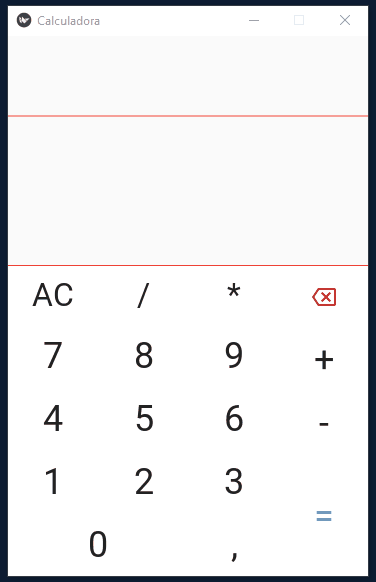

# SimpleCalc
<h1 align="center">
  
</h1>
<p align="center">Esse projeto foi feito em Kivy/KivyMD, para testar funcionalidades do mesmo.</p>
<p align="center">
  <a href="#Sobre">Sobre</a> •
  <a href="#Tecnologias">Tecnologias</a> •
  <a href="#Pré-Requisitos">Pré Requisitos</a> •
  <a href="#Licença">Licença</a> •
  <a href="#Autor">Autor</a>
</p>

## 📄 Sobre
  Aplicativo feito com Kivy e KivyMD, com intuito de testar funcionalidades do KivyMD e aprender um pouco mais de programação.

## ⚙️ Tecnologias
  - [Python 3.+](https://www.python.org/)
  - [Kivy](https://kivy.org/#home)
  - [KivyMD](https://kivymd.readthedocs.io/en/latest/getting-started/)

## 📜 Pré Requisitos
  Antes de continuar você precisa ter instalado em sua maquina as [tecnologias](#Tecnologias) citadas a cima.

 🎲 Rodando o Aplicativo

```bash
# Clone o repositorio do projeto
> git clone https://github.com/Kawdrin/Calculadora.git

# Entre na pasta do repositorio
> cd Calculadora

# Execute o app com python
> python .\main.py
```

## 🔰 Licença
    Licença MIT

    Copyright (c) 2021 Kawan Henrique

    A permissão é concedida, gratuitamente, a qualquer pessoa que obtenha uma cópia
    deste software e arquivos de documentação associados (o "Software"), para lidar
    no Software sem restrição, incluindo, sem limitação, os direitos
    para usar, copiar, modificar, mesclar, publicar, distribuir, sublicenciar e / ou vender
    cópias do Software, e para permitir que as pessoas a quem o Software é
    fornecido para fazê-lo, sujeito às seguintes condições:

    O aviso de direitos autorais acima e este aviso de permissão devem ser incluídos em todos
    cópias ou partes substanciais do Software.

    O SOFTWARE É FORNECIDO "COMO ESTÁ", SEM GARANTIA DE QUALQUER TIPO, EXPRESSA OU
    IMPLÍCITA, INCLUINDO, MAS NÃO SE LIMITANDO ÀS GARANTIAS DE COMERCIALIZAÇÃO,
    ADEQUAÇÃO A UMA FINALIDADE ESPECÍFICA E NÃO VIOLAÇÃO. EM NENHUMA HIPÓTESE O
    AUTORES OU TITULARES DE DIREITOS AUTORAIS SÃO RESPONSÁVEIS POR QUALQUER RECLAMAÇÃO, DANOS OU OUTROS
    RESPONSABILIDADE, SEJA EM AÇÃO DE CONTRATO, DELITO OU DE OUTRA FORMA, DECORRENTE DE,
    FORA DE OU EM CONEXÃO COM O SOFTWARE OU O USO OU OUTRAS NEGOCIAÇÕES NO
    PROGRAMAS.
## 👋 Autor
 
  [](https://www.linkedin.com/in/kawan-henrique-pereira/)
